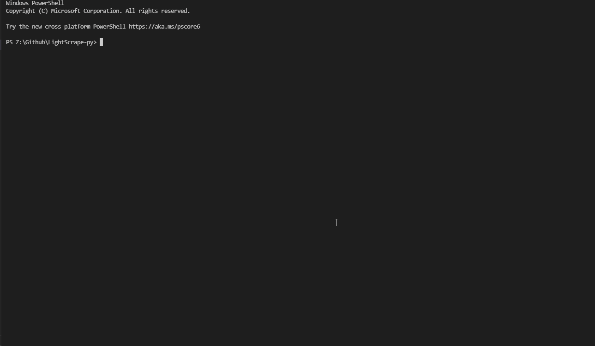

# Light Scrape
Simple application that downloads random Lightshot screenshots, my original version, made in c# with selenium was very slow, so I made this new version with more features. 

### WARNING: These are random images taken by people, because of this there may be gore, NSFW, obscene images, and more

## Usage:
1. Install Python on your computer
2. Download the LightScrape.py file
3. Install all the libraries

    a. I reccomend using pip for this, first download pip

    b. Then install each of the libraries using these commands

           pip install bs4
    
           pip install BeautifulSoup

           pip install xlsxwriter

           pip install pytesseract

           pip install cfscrape

           pip install cloudscraper

           pip install tkinter

4. Open cmd, and type cd followed by the folder where you downloaded LightScrape.py (Example: cd c:\user\downloads)
5. Type python LightScrape.py in the cmd window
6. Choose the options you want

## Terms
This program and source code is only for educational purposes. It shows the dangers of using a screenshot tool that automatically uploads images to a image host.

Any damage caused by this program is not the creators responsibility

These are random images taken by people, because of this there may be gore, NSFW, obscene images, and more

Only continue if you don't mind seeing images as such

DO NOT CONTINUE USING THIS PROGRAM OR THE SOURCE CODE IF YOU DO NOT AGREE WITH THE ABOVE
